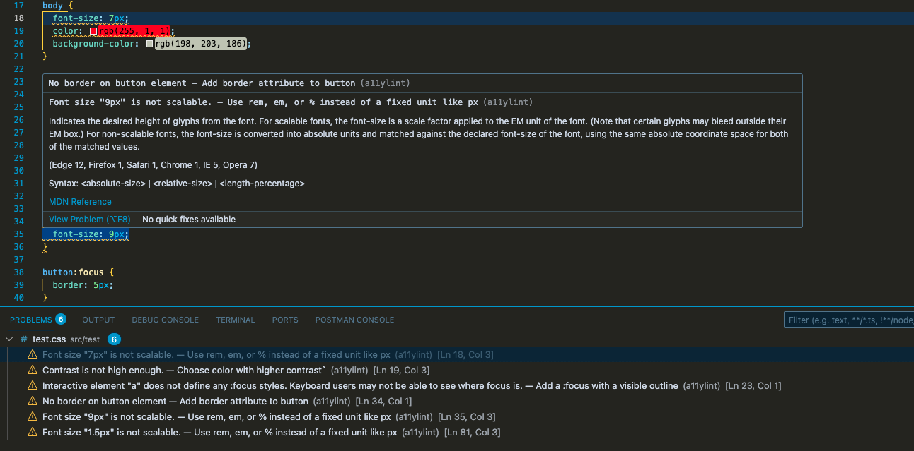

**Accessibility Linter for HTML, CSS & JSX**
---
A11y Lint is a lightweight developer-focused linter that scans **HTML**, **CSS**, and **JSX** files for common accessibility issues **during development** — right in your code editor.

👷🏽 **Why We Built This**
---
Web accessibility is **too often an afterthought**, discovered only in audits or by users who face barriers. Popular tools like [Axe](https://www.deque.com/axe/) are excellent, but they:
- Rely on runtime in-browser testing
- Are not always friendly for dev-first feedback
- Can feel too heavy or complex for small projects
**A11y Lint** solves this by working like ESLint — it gives **instant feedback in the editor** as you type.

🚀 **What Makes It Different?**
---
| Feature                  | A11y Lint                              | Axe (and others)          |
|--------------------------|----------------------------------------|---------------------------|
| Works in VS Code         | ✅ Yes                                 | ❌ (browser only)         |
| Runs statically on save  | ✅ Yes                                 | ❌ Needs runtime          |
| Custom rules per filetype| ✅ HTML, CSS, JSX                      | ✅ (but abstracted)       |
| Lightweight setup        | ✅ Simple, no browser dependency       | ❌ Requires browser/iframe|
| Developer-first workflow | ✅ Lints code during writing           | ❌ After-the-fact         |

⚙️ Quick Start
---
1. Clone or install the extension from source
2. Run your dev server with the extension active in VS Code
3. A11y Lint will highlight WCAG issues in HTML, CSS, or JSX files as you code

